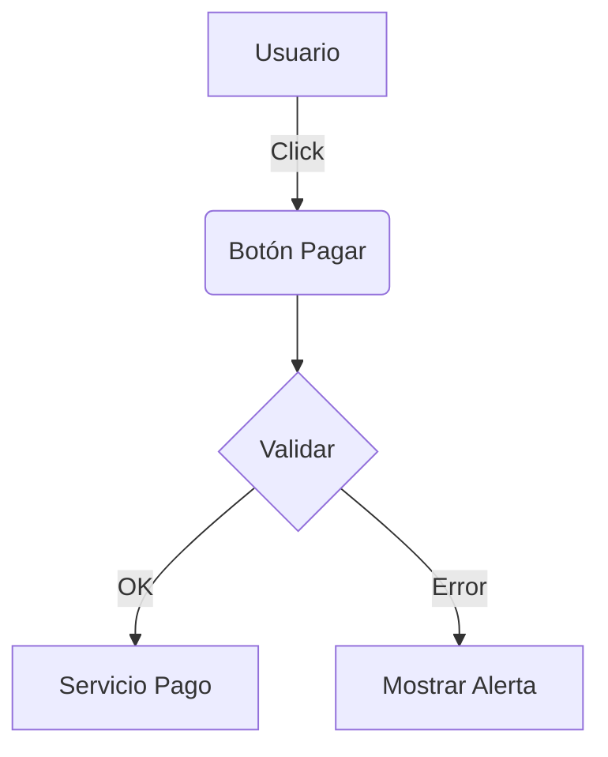

# Documentador Técnico

## Cuándo usar este skill
- Al finalizar la implementación de un nuevo Módulo o Servicio.
- Cuando se agrega una funcionalidad compleja que requiere explicación.
- Cuando el usuario pide "documentar el código" o "explicar cómo funciona".

## Flujo de trabajo
1.  **Código Fuente (JSDoc)**:
    -   Documenta todas las funciones/clases exportadas.
    -   Usa `@param` y `@returns` con tipos explícitos si no son obvios.
    -   Explica el "por qué", no solo el "qué".
2.  **Documentación Modular (README)**:
    -   Si creas una carpeta nueva importante (ej: `src/services/payments/`), crea un `README.md` dentro.
    -   Explica: Propósito, Arquitectura y Ejemplos de Uso.
3.  **Diagramas (Mermaid)**:
    -   Para flujos complejos (bucle de pagos, autenticación), genera un gráfico Mermaid en el README.

## Instrucciones

### 1. JSDoc Estándar
```typescript
/**
 * Calcula el total del pedido aplicando impuestos y descuentos.
 * 
 * @param subtotal - La suma de los precios de los items.
 * @param taxRate - Tasa de impuesto decimal (0.13 para 13%).
 * @returns El total final redondeado a 2 decimales.
 * 
 * @example
 * calculateTotal(100, 0.13) // returns 113.00
 */
export const calculateTotal = (subtotal: number, taxRate: number): number => { ... }
```

### 2. READMEs Modulares
Estructura mínima para `src/features/<feature>/README.md`:
-   **Título**: Nombre del feature.
-   **Descripción**: Qué hace y para qué sirve.
-   **Estructura**: Breve descripción de los archivos clave.
-   **Uso**: Snippet de código de cómo consumir este feature desde fuera.

### 3. Diagramas Mermaid
Usa sintaxis Mermaid dentro de bloques de código markdown para visualizar flujos:


## Recursos
-   [JSDoc Guide](https://jsdoc.app/)
-   [Mermaid.js Live Editor](https://mermaid.live/)
